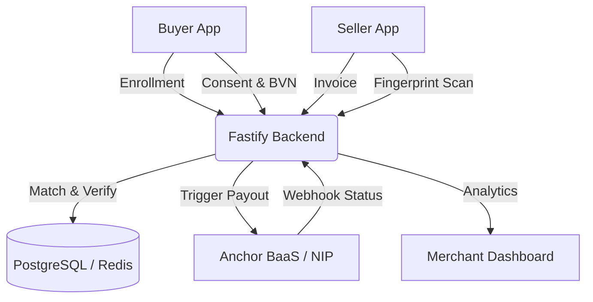

# Biometric Payment Network (BPN)

BPN is a secure, NDPR-compliant, non-custodial biometric payment micro-network for Nigeria's informal economy. 
It is designed to let buyers authorize transactions with fingerprint verification on an ordinary merchant smartphone, without requiring the buyer to present a card or use their phone at checkout.

## System Architecture & Flow



## Architecture

1. **Buyer App (React Native)**
   - Used for enrollment: verifies identity, creates the BPN authorization credential, and links one or more funding bank accounts. Cross-device fingerprint enrollment/identification is delegated to the selected production biometric provider; raw fingerprint data is not a BPN payment credential.
2. **Seller App (React Native)**
   - Acts as the POS terminal. The merchant generates an invoice (`/invoice`), the selected biometric provider captures/identifies the customer's fingerprint on the merchant smartphone, and BPN then requires transaction-bound authorization before payment.
3. **Backend Service (Node.js/Fastify)**
   - Fast, scalable API interface.
   - **Prisma/PostgreSQL**: Manages core relationships (Users, Accounts, AuditLogs for NDPR).
   - **Redis**: Caches POS sessions with short TTLs and provides strict IP-based rate limiting.
   - **Anchor BaaS**: Current development/integration payment rail. Production NIBSS integration remains an explicit future rail boundary.

## Setup & Running

### 1. Environment Configuration
Navigate to `services/backend`, copy `.env.example` to `.env`, and populate the actual keys for JWT, ANCHOR, and DB connections. Ensure Redis and PostgreSQL are running locally or via Docker.

### 2. Backend API
```bash
cd services/backend
npm install
npx prisma generate
npm run dev
```

### 3. Seller POS Application
It is recommended to run this on a physical Android device to access the actual Biometric sensor securely.
```bash
cd apps/seller
npm install
npx react-native run-android
```

### 4. Tests
The backend includes Jest automated testing for the biometric encryption functions and a Node testing script to simulate a full interaction flow.
```bash
cd services/backend
# Unit tests
npm test
# Integration Flow
node tests/full-flow.js
```

## Documentation & Guides

- [Manual Testing Guide](docs/MANUAL_TESTING.md): Step-by-step field verification.
- [Anchor Setup Guide](docs/ANCHOR_SETUP.md): Configuring the BaaS Sandbox.
- [API Collection](docs/bpn_api_collection.json): Postman JSON for manual requests.

### Mobile Biometric Integration Status
- The legacy device-local biometric helper is not the cross-device BPN recognition mechanism.
- A production biometric SDK must be installed and licensed before merchant fingerprint checkout is enabled.
- No simulated biometric provider is used as production evidence.
